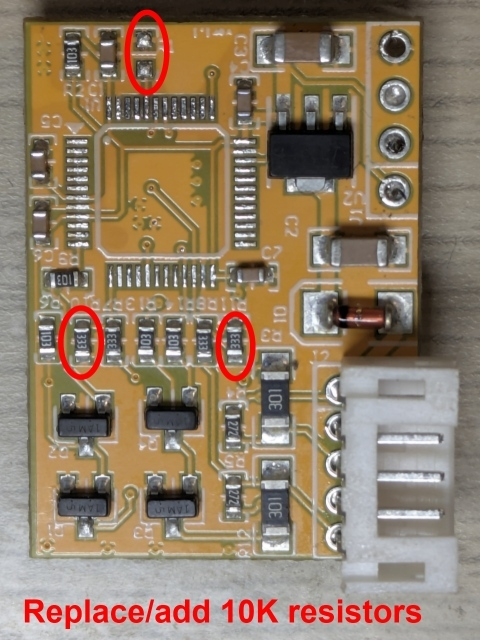

IC: CKS CKS32F103CBT6 LQFP-48. Clone of STM32F103CBT6. Internal crystal (HSI): max clock speed is 4MHz × 16 = 64MHz.
VR: HT7533-1

LIN connected to USART3 and USART2 through resistors and 1AM NPN SOT-23 transistors (likely MMBT3904).

**Pinout (white connector on the left pointing down, left to right):**  
1. 3V3  
2. SWDIO  
3. SWCLK  
4. GND  
[pinout](pinout.jpg)

Red cable: +12V
Black cable: GND
Blue cable: LIN master to steering wheel. USART3: RX from wheel is PB11, TX to wheel is PB10.  
Orange cable: LIN slave to steering wheel electronics. USART2: RX from car is PA3, TX to car is PA2.

**Corrections:**

* Replaced CKS32F103CBT6 with genuine STM32F103CBT6.
* Added 10k R1 BOOT0 resistor - Needed for genuine ST
* Changed R11 and R10 to 10K from 33K. This changes the voltage divider ratio from 2:1 to 3.3:1 which is needed to keep PB11 and PA3 within safe limits.  
